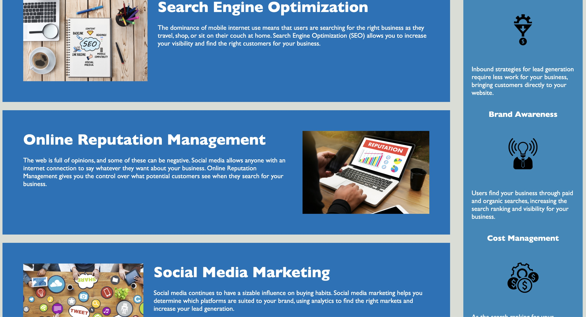

# heriseoncode

- [Description](#Description)
- [Screenshot](#Screenshot)
- [Acceptance_Criteria](#Acceptance_Criteria)
- [Installation](#Installation)
- [Credits](#Credits)
- [Contributing](#Contributing)

## Description

Horiseon is a webesite that informs its consumer on how to market oneself on the internet. It provides its clients with information on Search Engine Optimization, Online Reputation Management, and Social Media Marketing. It also provides users access to helpful resources on Brand Awareness, Cost Management, and how utalize Lead Generation. The point behind this project was to refactor the current html and css so that it is optimal for web accessibility. The hope is that the codebase has been edited to be cleaner than when it was found.

## Screenshot

## Acceptance_Criteria

IVEN a webpage meets accessibility standards
WHEN I view the source code
THEN I find semantic HTML elements
WHEN I view the structure of the HTML elements
THEN I find that the elements follow a logical structure independent of styling and positioning
WHEN I view the image elements
THEN I find accessible alt attributes
WHEN I view the heading attributes
THEN they fall in sequential order
WHEN I view the title element
THEN I find a concise, descriptive title

## Installation

Please visit my Github page - user name is martintara117. Once there, clone my heriseoncode repisitory - sorry for the misspelled word. Once cloned, you may add it to your repository. From there, you will git pull and type code . to open Visual Studio Code to edit.

## Credits

Credit goes to Georgia Tech Coding Boot Camp - for providing the intial html and css to be edited.
Finalized by Tara Martin

## Contributing
